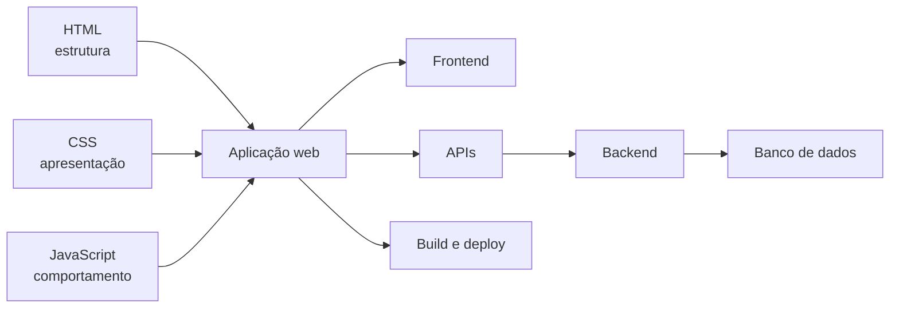

<div align="center">

# Guia Web Definitivo

### Um mapa visual para entender como a web moderna funciona

[](https://paulo968.github.io/guia-web/)


</div>

## Sobre o projeto

O Guia Web Definitivo foi criado como material de estudo e consulta para explicar como **HTML, CSS e JavaScript** trabalham juntos e como esses fundamentos se conectam a frontend, backend, APIs, bancos de dados, ferramentas de build, inteligência artificial e publicação de aplicações.

A aplicação utiliza tecnologias simples para manter o conteúdo leve, acessível e fácil de executar diretamente no navegador.

## Mapa de aprendizado



## Funcionalidades

- Cards interativos com conteúdo em modais;
- explicações técnicas acompanhadas de analogias;
- temas claro e escuro com persistência local;
- animações e layout responsivo;
- roadmap de aprendizado em desenvolvimento web;
- conteúdo executado diretamente no navegador.

## Conteúdo abordado

| Tema | Objetivo |
|---|---|
| HTML, CSS e JavaScript | Entender a responsabilidade de cada tecnologia |
| Frontend, backend e dados | Visualizar como as camadas se conectam |
| APIs | Compreender a comunicação entre sistemas |
| Frameworks e build | Conhecer a evolução para projetos modernos |
| Automação e IA | Explorar possibilidades além de páginas tradicionais |
| Deploy | Entender como uma aplicação chega à internet |

## Tecnologias

`HTML5` · `JavaScript` · `Tailwind CSS via CDN` · `Lucide Icons` · `Google Fonts`

## Estrutura

```text
guia-web/
├── assets/
├── index.html
└── README.md
```

## Executando localmente

```bash
git clone https://github.com/Paulo968/guia-web.git
cd guia-web
```

Depois, abra o arquivo `index.html` no navegador.

## Autor

Criado por [Paulo Zaqueu](https://github.com/Paulo968) como parte de sua transição da operação logística para tecnologia e desenvolvimento de sistemas.

[Portfólio](https://portfolio-paulo-ashy.vercel.app/) · [LinkedIn](https://www.linkedin.com/in/paulo-zaqueu-762459187) · [E-mail](mailto:paulozaqueu3@gmail.com)
